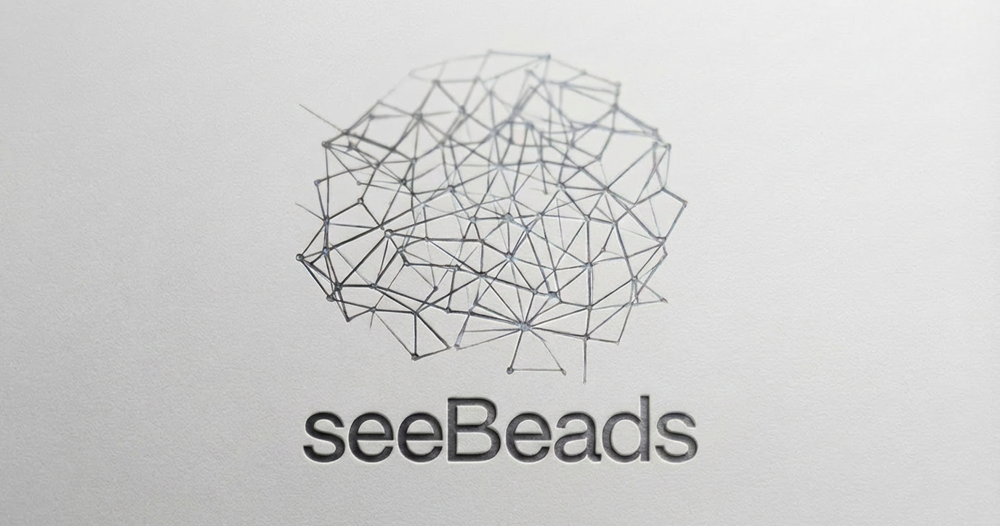

<p align="center">
  
</p>

A web dashboard for visualizing [Beads](https://github.com/steveyegge/beads) projects. Works with any project that has a `.beads/` folder.

Unofficial companion tool - not affiliated with the Beads project.

## What it does

- Reads your `.beads/beads.jsonl` file
- Displays issues in a web UI with filtering and search
- Updates in real-time when the file changes
- Provides dashboard, list, board, epic, and timeline views

## Install

```bash
git clone https://github.com/taylorkpotter/seeBeads.git
cd seeBeads
make build
```

## Usage

```bash
cd your-project    # any project with a .beads/ folder
seebeads serve --open
```

Opens at `http://localhost:3456`

### Options

```
--port, -p    Port (default: 3456)
--host, -H    Host (default: 127.0.0.1)
--open, -o    Open browser automatically
--agent-mode  Batch updates for AI workflows
```

## Keyboard shortcuts

| Key | Action |
|-----|--------|
| `/` | Search |
| `j` / `k` | Navigate |
| `Enter` | Open |
| `Esc` | Close |
| `1-5` | Switch views |

## Agent Mode

When AI agents are rapidly creating/modifying beads, Agent Mode batches UI updates to reduce jitter:

```bash
seebeads serve --agent-mode
```

## Security

Local development tool with no authentication. Don't expose on public networks.

## Development

```bash
cd web && npm install && cd ..
go mod download
make build
```

## Go embedding (optional)

If you're building a Go app, you can embed the dashboard directly:

```go
import "github.com/taylorkpotter/seeBeads"

http.Handle("/beads/", seebeads.Handler("", "/beads"))
```

See [AGENT_INSTALL.md](AGENT_INSTALL.md) for details.

## License

MIT
